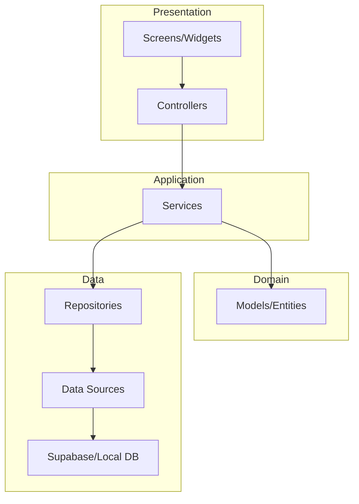

<!------------------------------------------------------------------------------------
   Add rules to this file or a short description and have Kiro refine them for you.
   
   Learn about inclusion modes: https://kiro.dev/docs/steering/#inclusion-modes
-------------------------------------------------------------------------------------> 

# 📚 BookSwipe - Flutter Project Structure

> Industry-level professional folder structure for Flutter + Riverpod + Supabase

## 🏗️ Architecture Overview

This project follows the **Feature-First Architecture** with **Clean Architecture principles**, recommended by [Code with Andrea](https://codewithandrea.com/articles/flutter-project-structure/) — the industry standard for scalable Flutter applications.

### Core Layers

| Layer | Responsibility | Components |
|-------|---------------|------------|
| **Presentation** | UI & State | Widgets, Screens, Controllers |
| **Application** | Business Logic | Services, Use Cases |
| **Domain** | Core Models | Entities, Value Objects |
| **Data** | Data Access | Repositories, DTOs, Data Sources |

---

## 📁 Complete Folder Structure

```
bookswipe/
├── android/                          # Android native code
├── ios/                              # iOS native code
├── web/                              # Web platform files
├── assets/                           # Static assets
│   ├── images/
│   │   ├── icons/
│   │   ├── illustrations/
│   │   └── placeholders/
│   ├── fonts/
│   ├── animations/                   # Lottie/Rive files
│   └── data/                         # JSON/mock data
│
├── lib/
│   ├── main.dart                     # App entry point (only ProviderScope init)
│   ├── main_development.dart         # Development environment entry
│   ├── main_staging.dart             # Staging environment entry
│   ├── main_production.dart          # Production environment entry
│   │
│   └── src/
│       ├── app.dart                  # MaterialApp with GoRouter + Theme
│       │
│       ├── bootstrap.dart            # App initialization & dependency setup
│       │
│       │── config/                   # App configuration
│       │   ├── app_config.dart       # Environment-specific config
│       │   ├── supabase_config.dart  # Supabase client setup
│       │   └── flavor_config.dart    # Build flavors
│       │
│       ├── constants/                # App-wide constants
│       │   ├── app_sizes.dart        # Spacing, padding, dimensions
│       │   ├── app_colors.dart       # Color palette
│       │   ├── app_strings.dart      # Static strings
│       │   ├── app_assets.dart       # Asset paths
│       │   ├── api_endpoints.dart    # API route constants
│       │   └── breakpoints.dart      # Responsive breakpoints
│       │
│       ├── theme/                    # Theming
│       │   ├── app_theme.dart        # ThemeData definitions
│       │   ├── text_styles.dart      # Typography
│       │   ├── color_schemes.dart    # Light/Dark color schemes
│       │   └── widget_themes/        # Component-specific themes
│       │       ├── button_theme.dart
│       │       ├── input_theme.dart
│       │       └── card_theme.dart
│       │
│       ├── routing/                  # Navigation (GoRouter)
│       │   ├── app_router.dart       # Main router configuration
│       │   ├── app_router.g.dart     # Generated routes (riverpod_generator)
│       │   ├── routes.dart           # Route path constants
│       │   └── guards/               # Route guards
│       │       └── auth_guard.dart
│       │
│       ├── localization/             # i18n
│       │   ├── app_localizations.dart
│       │   ├── l10n/
│       │   │   ├── app_en.arb
│       │   │   └── app_ar.arb
│       │   └── string_extensions.dart
│       │
│       ├── core/                     # Core utilities (cross-cutting concerns)
│       │   ├── providers/            # Global Riverpod providers
│       │   │   ├── supabase_provider.dart
│       │   │   └── shared_preferences_provider.dart
│       │   │
│       │   ├── network/              # Network layer
│       │   │   ├── api_client.dart
│       │   │   ├── api_response.dart
│       │   │   └── network_info.dart
│       │   │
│       │   ├── errors/               # Error handling
│       │   │   ├── failures.dart
│       │   │   ├── exceptions.dart
│       │   │   └── error_handler.dart
│       │   │
│       │   ├── utils/                # Utility functions
│       │   │   ├── validators.dart
│       │   │   ├── date_formatter.dart
│       │   │   ├── debouncer.dart
│       │   │   └── logger.dart
│       │   │
│       │   └── extensions/           # Dart extensions
│       │       ├── context_extensions.dart
│       │       ├── string_extensions.dart
│       │       ├── async_value_extensions.dart
│       │       └── date_extensions.dart
│       │
│       ├── common_widgets/           # Shared UI components
│       │   ├── buttons/
│       │   │   ├── primary_button.dart
│       │   │   ├── secondary_button.dart
│       │   │   └── icon_button.dart
│       │   │
│       │   ├── cards/
│       │   │   ├── book_card.dart
│       │   │   └── info_card.dart
│       │   │
│       │   ├── inputs/
│       │   │   ├── custom_text_field.dart
│       │   │   ├── search_field.dart
│       │   │   └── dropdown_field.dart
│       │   │
│       │   ├── dialogs/
│       │   │   ├── confirm_dialog.dart
│       │   │   └── loading_dialog.dart
│       │   │
│       │   ├── layouts/
│       │   │   ├── responsive_layout.dart
│       │   │   └── scaffold_with_navbar.dart
│       │   │
│       │   ├── loaders/
│       │   │   ├── shimmer_loading.dart
│       │   │   └── circular_loader.dart
│       │   │
│       │   ├── error_handling/
│       │   │   ├── error_message_widget.dart
│       │   │   └── async_value_widget.dart
│       │   │
│       │   └── animations/
│       │       ├── fade_animation.dart
│       │       └── slide_animation.dart
│       │
│       │── features/                 # Feature modules (Feature-First)
│       │   │
│       │   ├── auth/                 # 🔐 Authentication Feature
│       │   │   ├── data/
│       │   │   │   ├── repositories/
│       │   │   │   │   ├── auth_repository.dart
│       │   │   │   │   └── auth_repository_impl.dart
│       │   │   │   └── data_sources/
│       │   │   │       └── supabase_auth_data_source.dart
│       │   │   │
│       │   │   ├── domain/
│       │   │   │   ├── models/
│       │   │   │   │   ├── user_model.dart
│       │   │   │   │   └── user_model.freezed.dart
│       │   │   │   └── enums/
│       │   │   │       └── auth_status.dart
│       │   │   │
│       │   │   ├── application/
│       │   │   │   ├── auth_service.dart
│       │   │   │   └── auth_state.dart
│       │   │   │
│       │   │   └── presentation/
│       │   │       ├── screens/
│       │   │       │   ├── login_screen.dart
│       │   │       │   ├── signup_screen.dart
│       │   │       │   ├── forgot_password_screen.dart
│       │   │       │   └── verify_email_screen.dart
│       │   │       │
│       │   │       ├── controllers/
│       │   │       │   ├── auth_controller.dart
│       │   │       │   └── auth_controller.g.dart
│       │   │       │
│       │   │       └── widgets/
│       │   │           ├── social_login_buttons.dart
│       │   │           └── auth_form.dart
│       │   │
│       │   ├── onboarding/           # 📖 Onboarding Feature (Tinder-like)
│       │   │   ├── data/
│       │   │   │   └── repositories/
│       │   │   │       └── onboarding_repository.dart
│       │   │   │
│       │   │   ├── domain/
│       │   │   │   └── models/
│       │   │   │       ├── user_preferences.dart
│       │   │   │       └── reading_interests.dart
│       │   │   │
│       │   │   ├── application/
│       │   │   │   └── onboarding_service.dart
│       │   │   │
│       │   │   └── presentation/
│       │   │       ├── screens/
│       │   │       │   ├── welcome_screen.dart
│       │   │       │   ├── genre_selection_screen.dart
│       │   │       │   ├── reading_pace_screen.dart
│       │   │       │   └── initial_swipe_screen.dart
│       │   │       │
│       │   │       ├── controllers/
│       │   │       │   └── onboarding_controller.dart
│       │   │       │
│       │   │       └── widgets/
│       │   │           ├── preference_chip.dart
│       │   │           └── onboarding_progress.dart
│       │   │
│       │   ├── books/                # 📚 Books Feature
│       │   │   ├── data/
│       │   │   │   ├── repositories/
│       │   │   │   │   ├── book_repository.dart
│       │   │   │   │   └── book_repository_impl.dart
│       │   │   │   │
│       │   │   │   ├── data_sources/
│       │   │   │   │   ├── books_remote_data_source.dart
│       │   │   │   │   └── books_local_data_source.dart
│       │   │   │   │
│       │   │   │   └── dto/
│       │   │   │       ├── book_dto.dart
│       │   │   │       └── book_dto.g.dart
│       │   │   │
│       │   │   ├── domain/
│       │   │   │   ├── models/
│       │   │   │   │   ├── book.dart
│       │   │   │   │   ├── book.freezed.dart
│       │   │   │   │   ├── author.dart
│       │   │   │   │   └── genre.dart
│       │   │   │   │
│       │   │   │   └── enums/
│       │   │   │       └── book_status.dart
│       │   │   │
│       │   │   ├── application/
│       │   │   │   ├── book_service.dart
│       │   │   │   └── book_filter_service.dart
│       │   │   │
│       │   │   └── presentation/
│       │   │       ├── screens/
│       │   │       │   ├── book_detail_screen.dart
│       │   │       │   ├── book_list_screen.dart
│       │   │       │   └── book_search_screen.dart
│       │   │       │
│       │   │       ├── controllers/
│       │   │       │   ├── book_detail_controller.dart
│       │   │       │   ├── book_list_controller.dart
│       │   │       │   └── book_search_controller.dart
│       │   │       │
│       │   │       └── widgets/
│       │   │           ├── book_cover_image.dart
│       │   │           ├── book_info_section.dart
│       │   │           ├── rating_stars.dart
│       │   │           └── genre_tag.dart
│       │   │
│       │   ├── swipe/                # 👆 Swipe Feature (Core Feature)
│       │   │   ├── data/
│       │   │   │   ├── repositories/
│       │   │   │   │   └── swipe_repository.dart
│       │   │   │   │
│       │   │   │   └── data_sources/
│       │   │   │       └── swipe_remote_data_source.dart
│       │   │   │
│       │   │   ├── domain/
│       │   │   │   ├── models/
│       │   │   │   │   ├── swipe_action.dart
│       │   │   │   │   └── swipe_history.dart
│       │   │   │   │
│       │   │   │   └── enums/
│       │   │   │       └── swipe_direction.dart
│       │   │   │
│       │   │   ├── application/
│       │   │   │   ├── swipe_service.dart
│       │   │   │   └── recommendation_service.dart
│       │   │   │
│       │   │   └── presentation/
│       │   │       ├── screens/
│       │   │       │   └── swipe_screen.dart
│       │   │       │
│       │   │       ├── controllers/
│       │   │       │   ├── swipe_controller.dart
│       │   │       │   └── swipe_stack_controller.dart
│       │   │       │
│       │   │       └── widgets/
│       │   │           ├── swipe_card.dart
│       │   │           ├── swipe_stack.dart
│       │   │           ├── swipe_buttons.dart
│       │   │           ├── like_animation.dart
│       │   │           ├── dislike_animation.dart
│       │   │           └── undo_button.dart
│       │   │
│       │   ├── library/              # 📖 User Library Feature
│       │   │   ├── data/
│       │   │   │   └── repositories/
│       │   │   │       └── library_repository.dart
│       │   │   │
│       │   │   ├── domain/
│       │   │   │   ├── models/
│       │   │   │   │   ├── library_item.dart
│       │   │   │   │   └── reading_progress.dart
│       │   │   │   │
│       │   │   │   └── enums/
│       │   │   │       └── reading_status.dart
│       │   │   │
│       │   │   ├── application/
│       │   │   │   └── library_service.dart
│       │   │   │
│       │   │   └── presentation/
│       │   │       ├── screens/
│       │   │       │   ├── library_screen.dart
│       │   │       │   ├── liked_books_screen.dart
│       │   │       │   ├── reading_list_screen.dart
│       │   │       │   └── finished_books_screen.dart
│       │   │       │
│       │   │       ├── controllers/
│       │   │       │   └── library_controller.dart
│       │   │       │
│       │   │       └── widgets/
│       │   │           ├── library_tab_bar.dart
│       │   │           ├── book_grid_item.dart
│       │   │           └── empty_library_state.dart
│       │   │
│       │   ├── profile/              # 👤 Profile Feature
│       │   │   ├── data/
│       │   │   │   └── repositories/
│       │   │   │       └── profile_repository.dart
│       │   │   │
│       │   │   ├── domain/
│       │   │   │   └── models/
│       │   │   │       ├── user_profile.dart
│       │   │   │       └── user_stats.dart
│       │   │   │
│       │   │   ├── application/
│       │   │   │   └── profile_service.dart
│       │   │   │
│       │   │   └── presentation/
│       │   │       ├── screens/
│       │   │       │   ├── profile_screen.dart
│       │   │       │   ├── edit_profile_screen.dart
│       │   │       │   └── reading_stats_screen.dart
│       │   │       │
│       │   │       ├── controllers/
│       │   │       │   └── profile_controller.dart
│       │   │       │
│       │   │       └── widgets/
│       │   │           ├── profile_header.dart
│       │   │           ├── stats_card.dart
│       │   │           └── preference_section.dart
│       │   │
│       │   ├── settings/             # ⚙️ Settings Feature
│       │   │   ├── data/
│       │   │   │   └── repositories/
│       │   │   │       └── settings_repository.dart
│       │   │   │
│       │   │   ├── domain/
│       │   │   │   └── models/
│       │   │   │       └── app_settings.dart
│       │   │   │
│       │   │   ├── application/
│       │   │   │   └── settings_service.dart
│       │   │   │
│       │   │   └── presentation/
│       │   │       ├── screens/
│       │   │       │   ├── settings_screen.dart
│       │   │       │   ├── notification_settings_screen.dart
│       │   │       │   └── theme_settings_screen.dart
│       │   │       │
│       │   │       ├── controllers/
│       │   │       │   └── settings_controller.dart
│       │   │       │
│       │   │       └── widgets/
│       │   │           ├── settings_tile.dart
│       │   │           └── theme_switcher.dart
│       │   │
│       │   └── social/               # 👥 Social Feature (Optional)
│       │       ├── data/
│       │       │   └── repositories/
│       │       │       └── social_repository.dart
│       │       │
│       │       ├── domain/
│       │       │   └── models/
│       │       │       ├── friend.dart
│       │       │       └── book_recommendation.dart
│       │       │
│       │       ├── application/
│       │       │   └── social_service.dart
│       │       │
│       │       └── presentation/
│       │           ├── screens/
│       │           │   ├── friends_screen.dart
│       │           │   └── share_book_screen.dart
│       │           │
│       │           ├── controllers/
│       │           │   └── social_controller.dart
│       │           │
│       │           └── widgets/
│       │               ├── friend_card.dart
│       │               └── share_card.dart
│       │
│       └── generated/                # Code generation output
│           └── assets.gen.dart
│
├── test/                             # Tests (mirrors lib/ structure)
│   ├── src/
│   │   ├── features/
│   │   │   ├── auth/
│   │   │   │   ├── data/
│   │   │   │   ├── domain/
│   │   │   │   └── presentation/
│   │   │   └── swipe/
│   │   │       └── ...
│   │   └── core/
│   │       └── utils/
│   │
│   ├── mocks/                        # Mock classes
│   │   └── mock_repositories.dart
│   │
│   ├── fixtures/                     # Test fixtures/data
│   │   └── book_fixtures.dart
│   │
│   └── helpers/                      # Test helpers
│       └── test_utils.dart
│
├── integration_test/                 # Integration tests
│   └── app_test.dart
│
├── analysis_options.yaml             # Lint rules
├── pubspec.yaml                      # Dependencies
├── .env.example                      # Environment template
├── .gitignore
└── README.md
```

---

## 🎯 Key Principles

### 1. Feature-First Organization
- Each feature is **self-contained** with its own layers
- Easy to **add/remove features** without affecting others
- Features can be **developed in parallel** by different team members

### 2. Layer Responsibilities



### 3. Riverpod Provider Organization

```dart
// ✅ Provider in the same folder as the class it provides
// lib/src/features/auth/application/auth_service.dart

@riverpod
class AuthService extends _$AuthService {
  @override
  Future<AuthState> build() async {
    final authRepository = ref.watch(authRepositoryProvider);
    return authRepository.getCurrentUser();
  }
}
```

---

## 📦 Essential Dependencies

```yaml
# pubspec.yaml
dependencies:
  flutter:
    sdk: flutter
  
  # State Management
  flutter_riverpod: ^2.5.1
  riverpod_annotation: ^2.3.5
  
  # Backend
  supabase_flutter: ^2.3.0
  
  # Routing
  go_router: ^14.0.0
  
  # Code Generation
  freezed_annotation: ^2.4.1
  json_annotation: ^4.8.1
  
  # UI
  flutter_animate: ^4.3.0
  cached_network_image: ^3.3.1
  
  # Utils
  intl: ^0.19.0

dev_dependencies:
  # Code Generators
  riverpod_generator: ^2.4.0
  freezed: ^2.4.7
  json_serializable: ^6.7.1
  build_runner: ^2.4.8
  
  # Testing
  mocktail: ^1.0.1
  
  # Linting
  flutter_lints: ^3.0.1
```

---

## 📝 Naming Conventions

| Type | Convention | Example |
|------|------------|---------|
| Files | `snake_case` | `book_repository.dart` |
| Classes | `PascalCase` | `BookRepository` |
| Variables | `camelCase` | `bookList` |
| Constants | `SCREAMING_SNAKE` or `camelCase` | `API_BASE_URL` or `kDefaultPadding` |
| Providers | `camelCase + Provider` | `bookRepositoryProvider` |
| Controllers | `PascalCase + Controller` | `SwipeController` |
| Screens | `PascalCase + Screen` | `SwipeScreen` |

---

## 🔄 Supabase Integration Pattern

```dart
// lib/src/core/providers/supabase_provider.dart
@riverpod
SupabaseClient supabaseClient(SupabaseClientRef ref) {
  return Supabase.instance.client;
}

// lib/src/features/books/data/repositories/book_repository_impl.dart
@riverpod
BookRepository bookRepository(BookRepositoryRef ref) {
  final supabase = ref.watch(supabaseClientProvider);
  return BookRepositoryImpl(supabase);
}
```

---

## ✅ Best Practices Checklist

- [ ] Use `@riverpod` annotations (Riverpod Generator)
- [ ] Keep business logic in **Controllers/Services**, not in Widgets
- [ ] Use `AsyncValue<T>` for async state handling
- [ ] Repositories return **domain models**, not DTOs
- [ ] Use **Freezed** for immutable data classes
- [ ] Mirror `lib/` structure in `test/` folder
- [ ] One feature = One folder with all 4 layers

---

> **Source**: Based on [Code with Andrea's Riverpod Architecture](https://codewithandrea.com/articles/flutter-project-structure/) and industry best practices for Flutter + Supabase applications.
